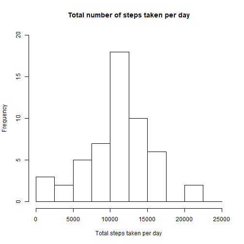
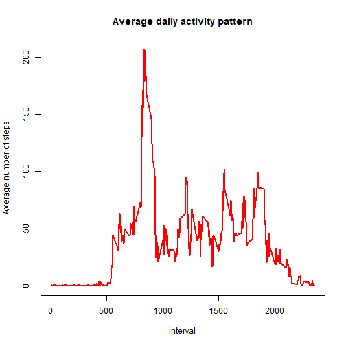
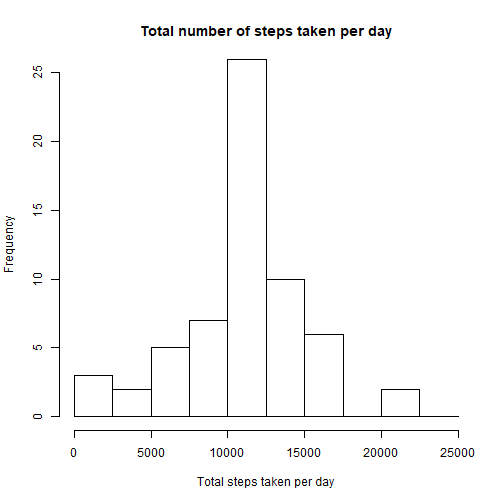
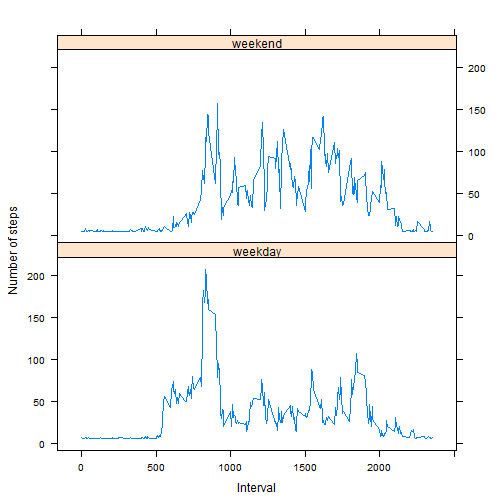

```r
title: "Reproducible Research: Course project 2"
```

```
## Warning: NAs introduced by coercion
```

```
## Error in title:"Reproducible Research: Course project 2": NA/NaN argument
```

```r
output: html_document
```

```
## Error in eval(expr, envir, enclos): object 'output' not found
```

```r
##setting options
```

```r
knitr:: opts_chunk$set(warning=FALSE)
```

##Loading and processing the data

```r
activity <- read.csv("activity.csv")
activity$date <- as.POSIXct(activity$date, "Y%-%m-%d")
Wday <- weekdays(activity$date)
activity <- cbind(activity, Wday)

summary(activity)
```

```
##      steps             date               interval             Wday     
##  Min.   :  0.00   Min.   :2012-10-01   Min.   :   0.0   Friday   :2592  
##  1st Qu.:  0.00   1st Qu.:2012-10-16   1st Qu.: 588.8   Monday   :2592  
##  Median :  0.00   Median :2012-10-31   Median :1177.5   Saturday :2304  
##  Mean   : 37.38   Mean   :2012-10-31   Mean   :1177.5   Sunday   :2304  
##  3rd Qu.: 12.00   3rd Qu.:2012-11-15   3rd Qu.:1766.2   Thursday :2592  
##  Max.   :806.00   Max.   :2012-11-30   Max.   :2355.0   Tuesday  :2592  
##  NA's   :2304                                           Wednesday:2592
```

##1.What is mean total number of steps taken per day?

```r
Total_steps <- aggregate(activity$steps~activity$date, FUN = sum)
names(Total_steps) <- c("date", "steps")

hist(Total_steps$steps, main= "Total number of steps taken per day", 
     xlab="Total steps taken per day", ylim=c(0,20), breaks = seq(0,25000, by=2500))
```



###Mean total steps per day

```r
mean(Total_steps$steps)
```

```
## [1] 10766.19
```

###Median Total steps per day

```r
median(Total_steps$steps)
```

```
## [1] 10765
```

##2.What is the average activity pattern?

```r
Average_daily_act <- aggregate(activity$steps, by=list(activity$interval), 
        FUN=mean, na.rm=TRUE)
names(Average_daily_act) <- c("interval", "mean")

plot(Average_daily_act$interval, Average_daily_act$mean, type="l", col="red", 
     lwd= 2, xlab = "interval", ylab = "Average number of steps",
     main = "Average daily activity pattern")
```



###Which 5-minutes interval, on average across all the days in the dataset, 
###contains the maximum number of steps?

```r
Average_daily_act[which.max(Average_daily_act$mean),]$interval
```

```
## [1] 835
```

##3.Imputing missing values

```r
sum(is.na(activity$steps))
```

```
## [1] 2304
```

###Strategy for filling in the missing values
To deal with missing values for activity$steps, I will substitute NA values with the Mean value of the variable steps

###Create a new dataset that is equal to the original dataset but with the missing data filled in

```r
activity_new <- activity
activity_new$steps[is.na(activity_new$steps)] <- mean(na.omit(activity$steps))
sum(is.na(activity_new$steps))
```

```
## [1] 0
```

###Make a histogram of the total number of steps taken each day and Calculate and report the mean and median total number of steps taken per day 

```r
Total_steps_new <- aggregate(activity_new$steps~activity_new$date, FUN = sum)
names(Total_steps_new) <- c("date", "steps")

hist(Total_steps_new$steps, main= "Total number of steps taken per day", 
     xlab="Total steps taken per day", ylim=c(0,25), breaks = seq(0,25000, by=2500))
```



###Mean total steps per day in the imputed dataset

```r
mean(Total_steps_new$steps)
```

```
## [1] 10766.19
```

###Median Total steps per day in the imputed dataset

```r
median(Total_steps_new$steps)
```

```
## [1] 10766.19
```

No significant differences whith the original values.

##4.Are there differences in activity patterns between weekdays and weekends?

1.Create a new factor variable in the dataset with two levels - "weekday" and "weekend" indicating whether a given date is a weekday or weekend day.


```r
is_weekday <- function(d) {
        weekd <- weekdays(d)
        ifelse (weekd == "Saturday" | weekd == "Sunday", "weekend", "weekday")
}

week <- sapply(activity_new$date, is_weekday)
activity_new$week_weekend <- as.factor(week)
```

2.Make a panel plot containing a time series plot (i.e. type = "l") of the 5-minute interval (x-axis) and the average number of steps taken, averaged across all weekday days or weekend days (y-axis). 


```r
library(lattice)
WeekEnd <- aggregate(steps ~ week+interval, data=activity_new, FUN=mean)

xyplot(steps ~ interval | factor(week),
       layout = c(1, 2),
       xlab="Interval",
       ylab="Number of steps",
       type="l",
       lty=1,
       data=WeekEnd)
```



During weekdays the activity peak is early in the morning while during the weekends the 
 overall activity is higher than in weekdays.
```

